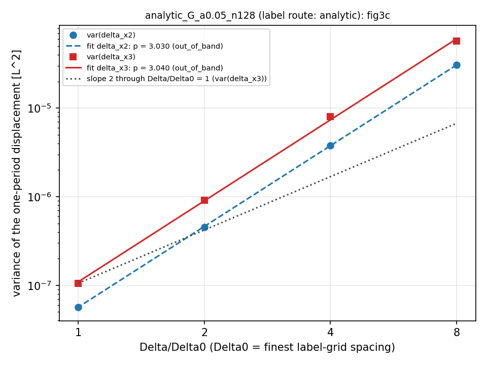
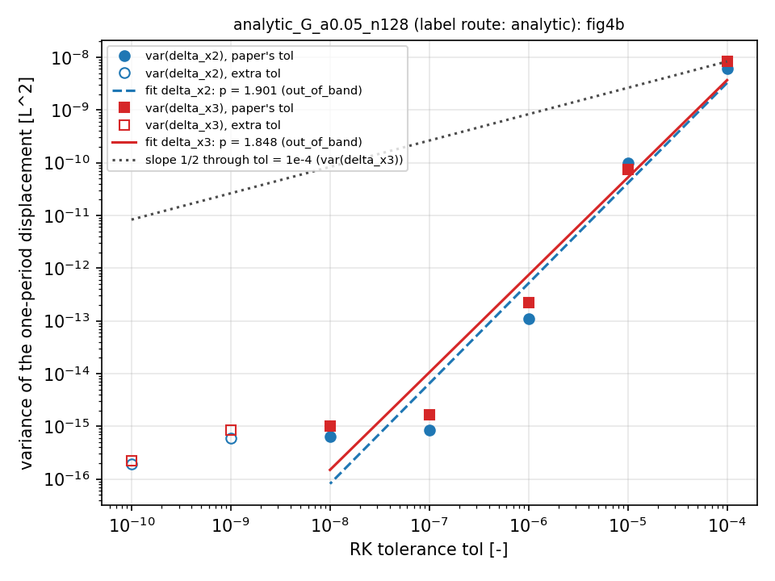
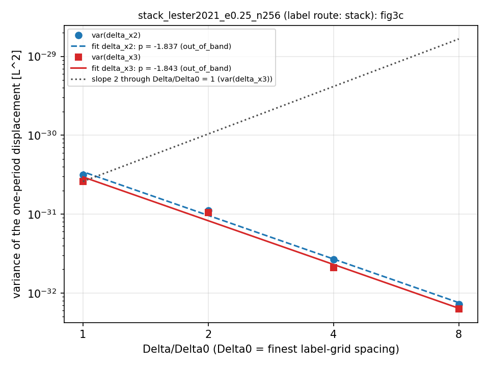
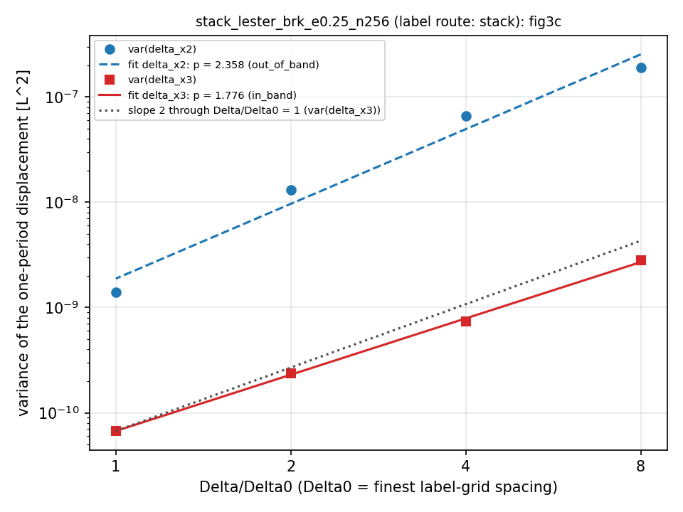
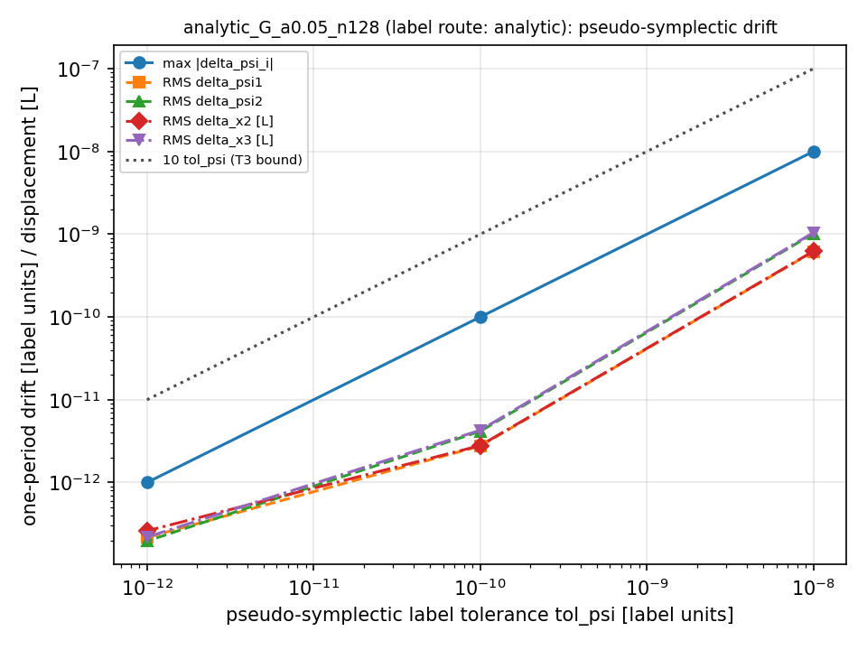
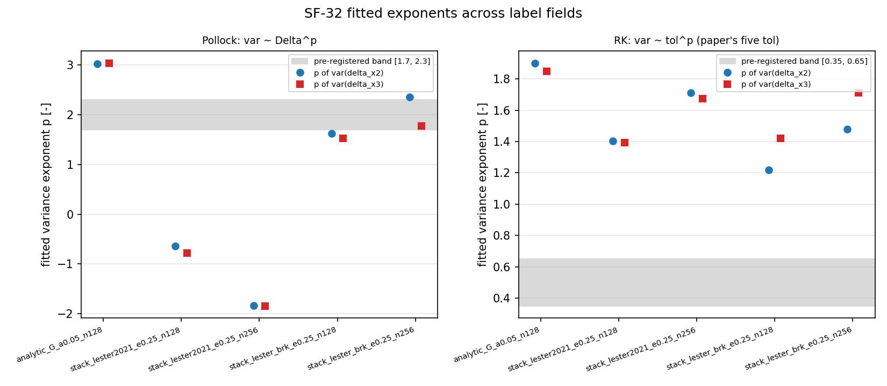

# Spurious transverse spreading of conventional trackers on surrogate flows with exact invariants (SF-32)

- Date: 2026-10-06
- Status: complete (human review pending)
- Increment: [`SF-32-reference-trackers-and-scalings.md`](../plans/active/lester-eq14/increments/SF-32-reference-trackers-and-scalings.md),
  Goal `Reproducir las figuras 3 y 4 de Lester 2023, mostrando la dispersión transversal espuria de los trackers convencionales frente al pseudo-simpléctico en un campo de invariantes exactos.`
- Theory: [`docs/theory/lester-2023-key-claims.md`](../theory/lester-2023-key-claims.md) (conventional
  tracking can create spurious transverse spreading; Pollock and Runge-Kutta tracking listed as such methods);
  Lester 2023 §5.1-5.4, eqs. 32-36, figs. 3-4 (`docs/references/Lester-2023-WRR.pdf`, pp. 10-14)
- Predecessors: [`2026-10-05-sf30-streamline-closure-gate.md`](2026-10-05-sf30-streamline-closure-gate.md)
  (the `lester2021` / `lester_brk` fields and the frozen-stack `e_v` numbers);
  [`2026-10-02-streamline-closure-and-eq14-vs-darcy.md`](2026-10-02-streamline-closure-and-eq14-vs-darcy.md)
  (finding R4: the mirror symmetry of the Lester (2021) field)
- Pre-registration: [`preregistration-understanding-record.md`](artifacts/2026-10-06-sf32-spurious-spreading/preregistration-understanding-record.md)
  (the orchestrator's UNDERSTAND record: readings T1-T4 in §5, predictions P1, P1', P2-P6 in §6, decisions D-1
  in §3.5, D-2 in §3.4, D-3 in §6, contract corrections with timestamps in §3, post-result findings and the
  post-hoc field in §10), [`dag.json`](artifacts/2026-10-06-sf32-spurious-spreading/dag.json)
- Artifacts: [`artifacts/2026-10-06-sf32-spurious-spreading/`](artifacts/2026-10-06-sf32-spurious-spreading/README.md)

Every number below is read from a committed file, unless it is marked "derived" (arithmetic on committed numbers,
done for this note). Sources:
`tables.md` = [`ladders/analysis/tables.md`](artifacts/2026-10-06-sf32-spurious-spreading/ladders/analysis/tables.md)
(output of `apps/spurious_spreading/analyze.py`; per field: §1 label metadata, §2 runs, §3 exponents and
pseudo-symplectic drift, §4 eq. 36 numbers, §5 consistency, §6 issues; then the cross-field table),
`exponents.json` = [`ladders/analysis/exponents.json`](artifacts/2026-10-06-sf32-spurious-spreading/ladders/analysis/exponents.json),
`summary.json` / `run.log` = `ladders/<field>/<tracker>_<level>/`, `labels/*.json` = the label metadata,
`logs/` = the V100 job logs, "the record" = the pre-registration record. Numbers have at most 4 significant digits.

## Question

On a surrogate flow whose invariants are exact by construction (`v = grad psi1 x grad psi2` of a splined affine +
periodic label pair, so every streamline returns to its start after one period in `x1`):

1. Does the Pollock tracker (RT0 cellwise-linear interpolation of exact Stokes face fluxes, eq. 32) produce
   spurious transverse displacement after one period, and how does its variance scale with the grid spacing
   `Delta` (paper, fig. 3c: `~ (Delta/Delta0)^2`)?
2. Does the adaptive Runge-Kutta tracker (SF-31 DP5(4) on the spline velocity) produce it, and how does its
   variance scale with the tolerance `tol` (paper, fig. 4b: `~ sqrt(tol)`)?
3. Does the pseudo-symplectic tracker (SF-31) stay on the label surfaces to `tol_psi`, i.e. show no spurious
   spreading beyond its label tolerance?

## Hypothesis

Spec bands (the paper's empirical laws, increment "Acceptance thresholds"; readings T1-T4 of record §5):

- T1 Pollock: least-squares slope of `var(delta_x2)` and of `var(delta_x3)` versus `Delta` over
  `Delta/Delta0 = 1, 2, 4, 8` in `[1.7, 2.3]` (>= 3 qualifying grids).
- T2 RK: slope of the variances versus `tol` over the paper's five tolerances `1e-4 .. 1e-8` in `[0.35, 0.65]`
  (>= 4 qualifying tolerances; the seven-level fit is reported).
- T3 pseudo-symplectic: `max_p max_i |delta_psi_i| <= 10 tol_psi` at every `tol_psi`, all seeds active.
- T4: an exponent outside its band is recorded, not tuned.

The orchestrator's own predictions, fixed in the record before any experiment run (record §6; times as recorded
there, see "Deviations" for the clock caveat):

- **P1** (Pollock): slope near 2 if the zero-mean `O(Delta)` RT0 velocity error accumulates coherently over the
  `1/Delta` cells of a period, 3 if it accumulates as a random walk; both admissible, 3 would be out of band.
- **P1'** (sharpened 2026-10-06T15:25Z from the orchestrator's numpy prototype on pair G, 1024 seeds, slopes
  3.09 / 2.94): an out-of-band Pollock slope near 3 on the splined fields in the asymptotic range; the paper's 2
  read as pre-asymptotic; the coarse end of the `lester2021` ladder may bend towards 2.
- **P2** (RK on a C^2 B-spline, velocity C^1): knot crossings make the global error `~ tol^(3/5)`, variance slope
  about 1.2; predicted range `[0.9, 1.7]`, OUT of the paper's band, possibly non-monotone at the tight end.
- **P3** (pseudo-symplectic): `max |delta_psi_i| <= tol_psi + 1e-14` for all seeds; `delta_x` RMS at the
  `tol_psi / |grad psi|` level (`<= 1e-9` at `tol_psi = 1e-10`).
- **P4** (face fluxes): divergence `<= 1e-13` relative; coarse = mean of fine to `1e-13`; exact to `1e-12`.
- **P5** (travel time): `<tau>` agrees across trackers to `O(Delta^2)` (Pollock) and `O(tol)` (RK);
  flux-weighted `<tau> = 1` to the spline/quadrature level.
- **P6** (label route): the stack at 256^3 leaves a usable state, `min |c| ~ 0.78`, `r_F <= 1e-5`.
  Not predicted: its iteration count, exit reason and wall time.
- **Post-hoc field prediction** (record §10, 2026-10-06T19:12Z, stated as made before its run): on `lester_brk`
  Pollock slope `2.7-3.3`, RK slope `1.0-2.0` with a plateau at the tight end, `max |delta_psi| <= tol_psi`.

## Build / environment

- Integrated source head `0f5b916` (orchestrator-audited; base `master = 37bfb25`); artifacts commit `579a5f1`.
  New code: `StokesFaceVelocity`, `PollockTracker` (`src/physics/particles/streamline_tracker/`), instrument
  `apps/spurious_spreading/` (`spurious_spreading` binary, `run_ladders.sh`, `analyze.py`). The frozen periodic
  stack (`src/physics/streamfunctions/`) and the SF-31 tracker cores are unchanged.
- V100 host (Tesla V100, CUDA / nvcc 11.4.152, GNU 9.3.1; `logs/sf32-labels.log`), preset `v100-release`,
  detached `scripts/remote --increment SF-32` jobs, two mirrors:
  - `~/MacroFlow3D-SF-32-labels` on the N2a tree `ef56372`: job `sf32-labels` (2026-10-06T15:42:17Z-15:47:15Z,
    GPU 0, exit 0) produced the analytic G and the two `lester2021` label fields;
  - `~/MacroFlow3D-SF-32` on `0f5b916`: `sf32-int-build` (configure + build `BUILD_EXIT=0`, `ctest -N` = 23,
    `ctest -R 'tracker|spurious'` 5/5), `sf32-ctest-full` (23/23 passed, `Total Test time (real) = 2752.88 sec`),
    `sf32-ladders` (16:08:31Z-16:10:45Z, GPU 1: `config_pspta_small` smoke `SMOKE_EXIT=0`, three ladders,
    analysis), `sf32-brk` (16:14:44Z-16:21:04Z, GPU 1: the two `lester_brk` label solves, their ladders,
    analysis over the five fields).
- The labels of `sf32-labels` come from `ef56372`, not from `0f5b916`. The README lists a bytewise-equivalence job
  `sf32-labels-equiv` (`ef56372` vs `0f5b916`, analytic G and `lester2021` 128^3); its log is NOT among the committed
  artifacts (pending at the time of this note).
- Local RTX 3050 (CUDA 13, sm_86): only the fast contract tests and the analysis self-test during development
  (orchestrator audit record); no experiment number in this note comes from a local run.
- Double precision; one GPU thread per seed; no atomics or reductions in the trackers.

## Config(s)

Label fields (`labels/*.json`, `tables.md` §1 of each field; `vbar = 1`, `gbar1 = (0, 1, 0)`, `gbar2 = (0, 0, 1)`,
SF-28 periodic tricubic B-spline of the cell-centred fluctuations):

| field (name in the tables) | route | amplitude | N | exit / status | iterations | `r_F` initial -> final | `e_v` | `min abs(c)` grid | wall (s) |
|---|---|---|---|---|---|---|---|---|---|
| `analytic_G_a0.05_n128` | analytic pair G (closed form, sampled) | `e = 0.05` | 128 | - | - | - | - | 0.7008 | 0.6786 |
| `stack_lester2021_e0.25_n128` | frozen stack, `lester2021` | `eps = 0.25` | 128 | stagnated / not_converged | 176 | 1.937e-2 -> 1.088e-6 | 2.720e-4 | 0.7750 | 147.3 |
| `stack_lester2021_e0.25_n256` | frozen stack, `lester2021` | `eps = 0.25` | 256 | stagnated / not_converged | 61 | 1.950e-2 -> 2.970e-5 | 6.776e-5 | 0.7746 | 98.79 |
| `stack_lester_brk_e0.25_n128` (post-hoc) | frozen stack, `lester_brk` | `eps = 0.25` | 128 | stagnated / not_converged | 142 | 1.570e-2 -> 3.819e-5 | 4.609e-4 | 0.7938 | 119.6 |
| `stack_lester_brk_e0.25_n256` (post-hoc) | frozen stack, `lester_brk` | `eps = 0.25` | 256 | stagnated / not_converged | 95 | 1.579e-2 -> 1.279e-5 | 3.786e-4 | 0.7935 | 151.1 |

- Pair G: `s1 = e [sin(2 pi x1) cos(2 pi x3) + 0.5 sin(2 pi (x2 + x3))]`,
  `s2 = e [cos(2 pi x1) sin(2 pi x2) + 0.5 cos(2 pi (x1 - x3))]` (`labels.json` `formula`); exact `min abs(c)` at
  the cell centres 0.7008.
- Stack runs: `Y = eps f` with `Y` variance 0.01031 on all four, tolerance 1e-8 (met by none), `epsilon = 1e-6`,
  Anderson on, Newton off, `AffineGauge::benchmark(1)`, SF-19 Darcy reference (`qbar = e1`, every corrector
  converged, `pcg_rtol = 1e-10`), `--max-iter 600`. The 128^3 `lester2021` solve repeats SF-30's numbers
  (176 iterations, `r_F` 1.088e-6, `e_v` 2.720e-4). `lester2021` = `sin 2 pi x1 cos 2 pi x2 sin 2 pi x3 +
  0.4 sin 2 pi x1 sin 8 pi x3` (shortest wavelength 1/4); `lester_brk` = the same with phase 0.9 in the second
  term (record §10), which removes the mirror symmetry.
- Seeds: `N_p = 8192` on the face `x1 = 0`, stateless 53-bit hash, seed `20261006`, identical in every run.
- Return map: first crossing of the unwrapped `x1 = 1`; `delta_x2 = x2_u - x2_0`, `delta_x3 = x3_u - x3_0`;
  `delta_psi_i` = labels at the landing point minus labels at the seed; landing tolerance `1e-12`, at most 60
  bisection trials (Pollock lands on the face exactly).
- Ladders (`run_ladders.sh`, record §3.6): Pollock `Delta/Delta0 = 1, 2, 4, 8` with `Delta0 = h` of the label
  grid (`Delta = 0.0625` at `m = 8` on 128^3); RK `tol = 1e-4 .. 1e-10` (seven), `dt_max = 0.25` absolute
  (D-2), chunk = `dt_max`; pseudo-symplectic `tol_psi = 1e-8, 1e-10, 1e-12`, `ds = h/2` (0.003906 on 128^3,
  0.001953 on 256^3). 14 runs per field, 70 runs.
- Analysis constants (one block in `analyze.py`, `tables.md` header): Pollock band `[1.7, 2.3]`, RK band
  `[0.35, 0.65]` on the paper's five tolerances, PS bound `10 tol_psi`, a level qualifies if
  `n_ok/n_seeds >= 0.99`, histograms 101 bins on `+-0.75` (Pollock), `+-0.04` (RK), `+-1e-9` (PS) — the paper's
  axes — plus an automatic `+-5 sigma` panel.

## Commands

From the repository root (orchestrator; detached V100 jobs; the command lines are copied from the log headers):

```bash
# labels (job sf32-labels, mirror SF-32-labels, tree ef56372)
B=./build/v100-release/spurious_spreading
$B analytic-labels --pair G --amplitude 0.05 --n 128 --out output_sf32/labels/analytic_G_a005_n128
$B solve-labels --field lester2021 --eps 0.25 --n 128 --max-iter 600 --out output_sf32/labels/stack_lester2021_e025_n128
$B solve-labels --field lester2021 --eps 0.25 --n 256 --max-iter 600 --out output_sf32/labels/stack_lester2021_e025_n256

# build + tests (jobs sf32-int-build, sf32-ctest-full, mirror SF-32, tree 0f5b916)
cmake --preset v100-release && cmake --build build/v100-release -j
ctest --test-dir build/v100-release --output-on-failure

# ladders + analysis (job sf32-ladders)
./build/v100-release/macroflow3d_pipeline apps/config_pspta_small.yaml > output_sf32/smoke_pspta_small.log 2>&1
for p in stack_lester2021_e025_n256 stack_lester2021_e025_n128 analytic_G_a005_n128; do
  bash apps/spurious_spreading/run_ladders.sh $B output_sf32/labels/$p output_sf32/ladders
done
python3 apps/spurious_spreading/analyze.py output_sf32/ladders

# post-hoc field (job sf32-brk)
for N in 128 256; do $B solve-labels --field lester_brk --eps 0.25 --n $N --max-iter 600 --out output_sf32/labels/stack_lester_brk_e025_n$N; done
for p in stack_lester_brk_e025_n256 stack_lester_brk_e025_n128; do
  bash apps/spurious_spreading/run_ladders.sh $B output_sf32/labels/$p output_sf32/ladders
done
python3 apps/spurious_spreading/analyze.py output_sf32/ladders
```

Each launcher run is `$B return-map --labels <prefix> --tracker <pollock|rk|pseudo_symplectic>
<--delta-ratio m | --tol t | --tol-psi t> --seeds 8192 --seed 20261006 --out <run_dir>` (`run_ladders.sh`;
the effective configuration of every run is in its `summary.json` `config`). Remote wrapper:
`scripts/remote --increment SF-32 run <job> -- "<command>"`, then `scripts/remote --increment SF-32 wait <job>`.

## Outputs inspected

### 1. Statuses, landing, consistency

- 70 runs, every one `n_ok = 8192/8192`, `status_counts = {"0": 8192}` (all `summary.json`); every launcher run
  `exit=0` (`logs/sf32-ladders.log`, `logs/sf32-brk.log`); `Issues: (none)` for every field and globally
  (`tables.md`).
- Landing: `landing.max_err` <= 9.999e-13 in every RK and pseudo-symplectic run (at most 39 bisection trials),
  0 in every Pollock run.
- Pollock face fluxes: `divergence_max_rel` between 2.133e-16 and 3.905e-15 in the 20 Pollock runs (`tables.md` §2,
  `div max rel`).
- Consistency (`tables.md` §5): the statistics recomputed from `seeds.csv` equal `summary.json` to at most
  3.47e-18 (absolute) on the displacement and label statistics and 5.66e-15 on `tau`; the `n_seeds`, `n_ok`
  differences are 0 in all 70 runs.

### 2. Analytic pair G (`analytic_G_a0.05_n128`; no symmetry; the exponent-bearing control)

Runs (`tables.md` §2; population variance over the 8192 seeds):

| tracker | level | var dx2 | var dx3 | max abs dx2 | max abs dx3 | mean tau | flux-weighted tau |
|---|---|---|---|---|---|---|---|
| Pollock | `Delta/Delta0 = 8` | 3.073e-05 | 5.725e-05 | 0.0274 | 0.03885 | 1.013163 | 1.001237 |
| Pollock | 4 | 3.805e-06 | 8.029e-06 | 0.00877 | 0.01556 | 1.013603 | 1.001442 |
| Pollock | 2 | 4.551e-07 | 9.077e-07 | 0.003716 | 0.006157 | 1.013694 | 1.001467 |
| Pollock | 1 | 5.688e-08 | 1.054e-07 | 0.00148 | 0.00242 | 1.013723 | 1.001482 |
| RK | `tol = 1e-4` | 6.127e-09 | 8.292e-09 | 0.0003425 | 0.0004376 | 1.013697 | 1.001452 |
| RK | 1e-5 | 9.703e-11 | 7.291e-11 | 6.815e-05 | 7.12e-05 | 1.013724 | 1.001479 |
| RK | 1e-6 | 1.087e-13 | 2.183e-13 | 3.06e-06 | 2.545e-06 | 1.013727 | 1.001482 |
| RK | 1e-7 | 8.515e-16 | 1.669e-15 | 1.393e-07 | 1.752e-07 | 1.013728 | 1.001482 |
| RK | 1e-8 | 6.468e-16 | 9.957e-16 | 1.656e-07 | 1.665e-07 | 1.013728 | 1.001482 |
| RK | 1e-9 | 6e-16 | 8.32e-16 | 1.357e-07 | 1.432e-07 | 1.013728 | 1.001482 |
| RK | 1e-10 | 1.928e-16 | 2.209e-16 | 7.763e-08 | 6.633e-08 | 1.013728 | 1.001482 |
| PS | `tol_psi = 1e-8` | 3.839e-19 | 1.093e-18 | 1.052e-08 | 1.392e-08 | 1.013731 | 1.001486 |
| PS | 1e-10 | 7.515e-24 | 1.836e-23 | 9.066e-11 | 1.29e-10 | 1.013731 | 1.001486 |
| PS | 1e-12 | 6.689e-26 | 4.788e-26 | 1.442e-12 | 1.645e-12 | 1.013731 | 1.001486 |

(`mean tau` and the flux-weighted `tau` are given to 7 significant digits, rounded from the 8 of `tables.md`,
because the tracker-to-tracker differences sit in the 6th digit.)

Exponents (`tables.md` §3, `exponents.json` `fields.analytic_G_a0.05_n128`):

| fit | component | slope p | R^2 | two-level estimates (coarse/loose first) | band | verdict |
|---|---|---|---|---|---|---|
| Pollock, `Delta/Delta0 = 1, 2, 4, 8` | `delta_x2` | 3.030 | 0.99998 | 3.014, 3.064, 3.000 | [1.7, 2.3] | `out_of_band` |
| Pollock | `delta_x3` | 3.040 | 0.99947 | 2.834, 3.145, 3.106 | [1.7, 2.3] | `out_of_band` |
| RK, paper's five tol [verdict] | `delta_x2` | 1.901 | 0.94118 | 1.800, 2.951, 2.106, 0.119 | [0.35, 0.65] | `out_of_band` |
| RK, paper's five tol [verdict] | `delta_x3` | 1.848 | 0.95138 | 2.056, 2.524, 2.117, 0.224 | [0.35, 0.65] | `out_of_band` |
| RK, all seven [reported] | `delta_x2` | 1.255 | 0.83331 | ..., 0.119, 0.033, 0.493 | [0.35, 0.65] | `out_of_band` |
| RK, all seven [reported] | `delta_x3` | 1.248 | 0.85491 | ..., 0.224, 0.078, 0.576 | [0.35, 0.65] | `out_of_band` |

No fit is flagged `non_monotone` on G. `var(delta_x3) > var(delta_x2)` at every Pollock level (by a factor 1.853
at `Delta/Delta0 = 1`, derived), the ordering of the paper's fig. 3c.





PDFs (analogues of figs. 3b and 4a; left panel on the paper's fixed axes, right panel `+-5 sigma`):
[`fig3b_analytic_G_a0.05_n128.png`](artifacts/2026-10-06-sf32-spurious-spreading/ladders/analysis/fig3b_analytic_G_a0.05_n128.png),
[`fig4a_analytic_G_a0.05_n128.png`](artifacts/2026-10-06-sf32-spurious-spreading/ladders/analysis/fig4a_analytic_G_a0.05_n128.png);
binned counts in [`histograms/`](artifacts/2026-10-06-sf32-spurious-spreading/ladders/analysis/histograms/).
On the paper's axis (`+-0.75`) the Pollock PDFs are narrow spikes: the largest one-period displacement on G is
0.03885 (`Delta/Delta0 = 8`).

### 3. `lester2021` stack pairs (128^3, 256^3): degenerate for the Pollock question (F-SYM)

Pollock (`tables.md` §2): every level returns to the start to roundoff.

| field | `Delta/Delta0` | var dx2 | var dx3 | max abs dx2 | max abs dx3 |
|---|---|---|---|---|---|
| 128^3 | 8 / 4 / 2 / 1 | 4.937e-34 / 1.39e-33 / 2.754e-33 / 1.744e-33 | 2.802e-34 / 1.401e-33 / 1.693e-33 / 1.601e-33 | <= 1.776e-15 | <= 3.331e-16 |
| 256^3 | 8 / 4 / 2 / 1 | 7.231e-33 / 2.682e-32 / 1.111e-31 / 3.141e-31 | 6.281e-33 / 2.103e-32 / 1.053e-31 / 2.595e-31 | <= 3.914e-15 | <= 3.442e-15 |

The fitted "slopes" are roundoff scaling, not tracker properties: `-0.6447 / -0.7815` (128^3, R^2 0.62945 /
0.65789) and `-1.837 / -1.843` (256^3), all `out_of_band, non_monotone` (`tables.md` cross-field table). The variances
span 2.802e-34 .. 3.141e-31 (the record's §10 wording "1e-31 .. 1e-33" understates the lower end).

Mechanism (record §10, F-SYM, recorded 2026-10-06T19:10Z, numeric check 19:15Z): the Lester (2021) field is
mirror-symmetric under `x1 -> 1/2 - x1`; the stack labels inherit it (`max |u_i(Mx) - u_i(x)|` = 3.1e-16 /
2.9e-16 on 128^3 and 4.6e-15 / 5.4e-15 on 256^3, both fluctuations even, `max |u_i|` about 1.4e-2 / 1.7e-2); the
Stokes face fluxes on an even Pollock grid inherit it (`u` even, `v`, `w` odd), the RT0 interpolant maps cells to
mirror cells, and the RT0 trajectory from `x1 = 0` is mirrored back: exact return. Pair G has no such symmetry
(`u2` has no parity). This is the symmetry that makes the Lester (2021) field the published case whose Darcy
streamlines close (2026-10-02 finding R4; SF-30 note R1: closes to 3.1e-11). The mirror-image numbers are in the
record, not in a separate artifact.

RK on `lester2021` (`tables.md` §3; every fit `out_of_band`):

| field | five tol, x2 / x3 | all seven, x2 / x3 | two-level, five tol, x2 |
|---|---|---|---|
| 128^3 | 1.404 / 1.395 | 1.001 / 1.024 (`non_monotone`) | 0.562, 1.559, 2.318, 0.643 |
| 256^3 | 1.712 / 1.673 | 1.392 / 1.397 | 0.561, 1.563, 2.563, 1.811 |

The record reads the RK numbers on `lester2021` as contaminated by a partial symmetry cancellation ("errors ~50x
smaller than on G"). What the data show (derived from `tables.md` §2): the RMS of `delta_x2` on G over that on
`lester2021` 128^3 is 51.9 at `tol = 1e-4`, but 12.36, 2.5, 3.169, 5.788 at `1e-5 .. 1e-8`; and at the same
`eps` and `N` the non-symmetric `lester_brk` pair has RK variances of the same order as `lester2021`
(`tol = 1e-4`, 128^3: 4.675e-13 / 2.911e-12 against 2.331e-12 / 2.165e-12). The G-to-`lester2021` ratio therefore
does not isolate a symmetry effect (the two fields differ in amplitude and spectrum); the RK exponents on
`lester2021` are reported as measured, with the caveat that a residual symmetry effect is neither demonstrated
nor excluded.



### 4. `lester_brk` stack pairs (post-hoc; no symmetry)

Pollock (`tables.md` §2-3):

| field | `Delta/Delta0` 8 / 4 / 2 / 1: var dx2 | var dx3 | slope x2 / x3 (R^2) | two-level x2 | two-level x3 | verdict x2 / x3 |
|---|---|---|---|---|---|---|
| 128^3 | 3.963e-07 / 1.883e-07 / 6.59e-08 / 1.309e-08 | 5.123e-09 / 2.786e-09 / 7.299e-10 / 2.348e-10 | 1.627 / 1.528 (0.97048 / 0.98030) | 1.073, 1.515, 2.331 | 0.879, 1.932, 1.637 | `out_of_band` / `out_of_band` |
| 256^3 | 1.888e-07 / 6.605e-08 / 1.309e-08 / 1.395e-09 | 2.797e-09 / 7.359e-10 / 2.377e-10 / 6.729e-11 | 2.358 / 1.776 (0.97419 / 0.99907) | 1.515, 2.335, 3.231 | 1.926, 1.630, 1.821 | `out_of_band` / `in_band` |

- Pollock depends on the absolute `Delta`, not on the label grid: at the same `Delta` (`Delta/Delta0 = 4` on
  128^3 = `8` on 256^3 = 1/32, and so on) the two label resolutions give 1.883e-07 / 1.888e-07,
  6.59e-08 / 6.605e-08, 1.309e-08 / 1.309e-08 (`dx2`) and 2.786e-09 / 2.797e-09, 7.299e-10 / 7.359e-10,
  2.348e-10 / 2.377e-10 (`dx3`).
- The two-level estimates of `dx2` rise from 1.073 at the coarsest pair to 3.231 at the finest; those of `dx3` stay
  between 0.879 and 1.932 and do not rise towards 3 over the ladder.
- The coarse levels are under-resolved for this field: its shortest wavelength is 1/4, and `Delta/Delta0 = 8` is
  `Delta = 1/16` (128^3) or 1/32 (256^3), i.e. 4 or 8 cells per shortest wavelength (derived).
- Here `var(delta_x2) >> var(delta_x3)` (factor 67.5 at `Delta = 1/32` on 256^3, derived), the opposite ordering of
  G and of the paper's fig. 3c.

RK (`tables.md` §3; all `out_of_band`): five tolerances 1.218 / 1.421 (128^3), 1.479 / 1.711 (256^3); all seven
0.901 / 1.057 (128^3, `non_monotone`), 1.285 / 1.446 (256^3).



Other figures of this field: [`fig4b_stack_lester_brk_e0.25_n256.png`](artifacts/2026-10-06-sf32-spurious-spreading/ladders/analysis/fig4b_stack_lester_brk_e0.25_n256.png),
[`fig3b_stack_lester_brk_e0.25_n256.png`](artifacts/2026-10-06-sf32-spurious-spreading/ladders/analysis/fig3b_stack_lester_brk_e0.25_n256.png),
[`fig4a_stack_lester_brk_e0.25_n256.png`](artifacts/2026-10-06-sf32-spurious-spreading/ladders/analysis/fig4a_stack_lester_brk_e0.25_n256.png).

### 5. RK tight-tolerance floor depends on the label grid

Below `tol ~ 1e-7` the RK variance stops following `tol` (G: two-level estimates 0.119, 0.033, 0.493 over
`1e-7 .. 1e-10`). On the stack pairs the floor is lower on the finer label grid: at `tol = 1e-8`, `var(dx2)` =
1.933e-17 (128^3) against 7.426e-19 (256^3) on `lester2021`, 1.976e-17 against 1.228e-18 on `lester_brk`
(`tables.md` §2). At loose tolerance the two label grids agree (`lester_brk`, `tol = 1e-4`: 4.675e-13 / 4.674e-13).

### 6. Pseudo-symplectic drift (T3)

`tables.md` §3 "Pseudo-symplectic drift", `exponents.json` `pseudo_symplectic`:

| field | `tol_psi` 1e-8 / 1e-10 / 1e-12: max abs dpsi_i / tol_psi | rms dx2 / tol_psi | rms dx3 / tol_psi | verdict |
|---|---|---|---|---|
| G 128^3 | 0.9999 / 0.9993 / 1 | 0.06236 / 0.02795 / 0.2605 | 0.1045 / 0.04284 / 0.2189 | pass, pass, pass |
| `lester2021` 128^3 | 1 / 0.9983 / 0.9569 | 0.28 / 0.087 / 0.03419 | 0.3539 / 0.08416 / 0.03674 | pass, pass, pass |
| `lester2021` 256^3 | 0.9997 / 0.9999 / 0.9849 | 0.3193 / 0.08826 / 0.03454 | 0.403 / 0.08636 / 0.03724 | pass, pass, pass |
| `lester_brk` 128^3 | 0.9998 / 0.9955 / 0.008549 | 0.1469 / 0.03039 / 0.02371 | 0.3082 / 0.04324 / 0.02474 | pass, pass, pass |
| `lester_brk` 256^3 | 0.9999 / 0.9985 / 0.5794 | 0.1709 / 0.03059 / 0.02392 | 0.3205 / 0.0481 / 0.02563 | pass, pass, pass |

- `max_abs_delta_psi <= tol_psi` in all 15 runs (largest: 9.999778782798785e-13 at `tol_psi = 1e-12` on G,
  `exponents.json`); the spec bound is `10 tol_psi`; every seed active.
- The transverse displacements are at the label-tolerance level: RMS `delta_x` between 0.02371 and 0.403
  `tol_psi`, max `abs(delta_x)` up to 1.645 `tol_psi` (G, `tol_psi = 1e-12`, `exponents.json`
  `delta_x3_max_over_tol`). At `tol_psi = 1e-12` the RMS on G is 2.605e-13 / 2.189e-13, at the scale of the landing
  tolerance `1e-12`.
- `lester_brk` 128^3 at `tol_psi = 1e-12`: max label drift 8.549e-15 (100x below `tol_psi`) while the RMS
  displacement is 2.371e-14 (`tables.md` §2); not explained here.



### 7. Travel times (P5)

- Tracker agreement on G (derived from the full-precision `stats.tau.mean` of each `summary.json`): Pollock minus
  converged RK (`tol = 1e-10`) is -5.646e-4, -1.249e-4, -3.394e-5, -4.862e-6 at `Delta/Delta0 = 8, 4, 2, 1`
  (ratios 4.52, 3.68, 6.98 per halving); RK at `tol = 1e-4` differs by -3.085e-5 and agrees to 7 digits from
  `1e-7`; pseudo-symplectic minus RK is +3.507e-6 at `ds = h/2`, the SF-31 `O(ds^2)` clock bias (N2a audit:
  Simpson clock).
- Flux-weighted `<tau>`: 0.9999736 .. 1.000079 on the four stack fields (offsets from 1 below 8e-5), but
  1.001237 .. 1.001486 on G (offset up to 1.486e-3, derived; not shrinking with `Delta`; equal across the converged
  trackers).

### 8. Eq. (36) numbers (protocol numbers of the surrogate, not coefficients; O3)

`D_ii = var(delta_xi) / (2 <tau>)` (`tables.md` §4). On G (uniform seeds): Pollock 1.517e-05 / 2.825e-05 at
`Delta/Delta0 = 8` down to 2.806e-08 / 5.201e-08 at 1; RK 3.022e-09 / 4.09e-09 at `tol = 1e-4` down to
9.509e-17 / 1.09e-16 at `1e-10`; pseudo-symplectic 1.893e-19 / 5.389e-19 at `tol_psi = 1e-8` down to
3.299e-26 / 2.361e-26. Flux-weighted values in `tables.md` §4. They are the numbers the re-injection protocol
returns for tracker ERRORS on a flow whose exact answer is zero; they are not macrodispersion coefficients.

## Result

- **R1 — Pollock produces spurious transverse displacement, with the random-walk law (G).** On the analytic pair G
  the one-period variance follows `Delta^3.030` (`x2`) and `Delta^3.040` (`x3`), R^2 0.99998 / 0.99947, two-level
  estimates 2.834-3.145 at every level: verdict `out_of_band` for the spec band `[1.7, 2.3]` (T1 not met; recorded,
  not tuned). `var(delta_x3) > var(delta_x2)`, as in the paper.
- **R2 — The `lester2021` field is degenerate for the Pollock question (F-SYM, not predicted).** On both stack pairs
  the Pollock return map is exact to roundoff (variances 2.802e-34 .. 3.141e-31, `max abs(delta)` <= 3.914e-15,
  8192/8192 ok) because of the mirror symmetry `x1 -> 1/2 - x1`; the negative fitted slopes carry no information.
  The spec's primary field cannot measure a Pollock exponent.
- **R3 — On the non-symmetric stack field the Pollock exponent is pre-asymptotic.** `lester_brk`: four-point slopes
  1.627 / 1.528 (128^3, both `out_of_band`) and 2.358 / 1.776 (256^3: `x2` `out_of_band`, `x3` `in_band`). The
  `x2` two-level estimates rise from 1.073 to 3.231 as `Delta` decreases; the `x3` ones stay at 0.879-1.932. The
  Pollock variance depends on the absolute `Delta` and not on the label grid (128^3 and 256^3 agree within 1.24 %
  at equal `Delta`, derived).
- **R4 — RK produces spurious displacement, out of the paper's band on every field.** Paper's five tolerances:
  1.901 / 1.848 (G), 1.404 / 1.395 and 1.712 / 1.673 (`lester2021`), 1.218 / 1.421 and 1.479 / 1.711 (`lester_brk`);
  all seven: 0.901-1.446 on the stack fields, 1.255 / 1.248 on G. Every verdict `out_of_band` for `[0.35, 0.65]`
  (T2 not met; recorded, not tuned). Below `tol ~ 1e-7` the variance reaches a floor (G two-level 0.119, 0.033,
  0.493) whose level falls with the label grid spacing (section 5).
- **R5 — The pseudo-symplectic tracker stays on the label surfaces.** `max abs(delta_psi_i) <= tol_psi` in all 15
  runs (ratio 0.008549-1; bound 10), all seeds active, transverse RMS 0.02371-0.403 `tol_psi`: no spurious spreading
  beyond the label tolerance (T3 met with the 10x margin). This is the qualitative message of the paper's figs. 3-4
  (conventional trackers spread, the invariant-preserving one does not), reproduced at the instrument level on
  the surrogate.
- **R6 — Instrument health.** 70 runs, no non-zero status, landing <= 9.999e-13, Pollock face-flux divergence
  <= 3.905e-15 relative, recomputed statistics equal the summaries (`tables.md` §5), 23/23 `ctest` on V100.
- **R7 — Gate 4 classification.** Every transverse displacement measured here is NUMERICAL by construction (the
  exact one-period return is the identity on the surrogate). Nothing is inferred about physical transverse
  macrodispersion; `alpha_T` is neither presupposed nor measured; the eq. (36) numbers of section 8 are protocol
  numbers (O3).

Band verdicts exactly as `analyze.py` printed them (`logs/sf32-brk.log`, final table; identical to `tables.md`):

| field | Pollock p var(dx2) | Pollock p var(dx3) | RK p var(dx2) (5 tol) | RK p var(dx3) (5 tol) | RK p var(dx2) (all) | RK p var(dx3) (all) | PS T3 |
|---|---|---|---|---|---|---|---|
| analytic_G_a0.05_n128 | 3.030 (out_of_band) | 3.040 (out_of_band) | 1.901 (out_of_band) | 1.848 (out_of_band) | 1.255 (out_of_band) | 1.248 (out_of_band) | 1e-08:pass, 1e-10:pass, 1e-12:pass |
| stack_lester2021_e0.25_n128 | -0.645 (out_of_band, non_monotone) | -0.781 (out_of_band, non_monotone) | 1.404 (out_of_band) | 1.395 (out_of_band) | 1.001 (out_of_band, non_monotone) | 1.024 (out_of_band, non_monotone) | 1e-08:pass, 1e-10:pass, 1e-12:pass |
| stack_lester2021_e0.25_n256 | -1.837 (out_of_band, non_monotone) | -1.843 (out_of_band, non_monotone) | 1.712 (out_of_band) | 1.673 (out_of_band) | 1.392 (out_of_band) | 1.397 (out_of_band) | 1e-08:pass, 1e-10:pass, 1e-12:pass |
| stack_lester_brk_e0.25_n128 | 1.627 (out_of_band) | 1.528 (out_of_band) | 1.218 (out_of_band) | 1.421 (out_of_band) | 0.901 (out_of_band, non_monotone) | 1.057 (out_of_band, non_monotone) | 1e-08:pass, 1e-10:pass, 1e-12:pass |
| stack_lester_brk_e0.25_n256 | 2.358 (out_of_band) | 1.776 (in_band) | 1.479 (out_of_band) | 1.711 (out_of_band) | 1.285 (out_of_band) | 1.446 (out_of_band) | 1e-08:pass, 1e-10:pass, 1e-12:pass |



Scorecard of the pre-registered predictions:

| prediction | outcome | numbers |
|---|---|---|
| T1 Pollock `p` in `[1.7, 2.3]` (spec band) | not met | G 3.030 / 3.040; `lester_brk` 1.627 / 1.528, 2.358 / 1.776 (`x3` 256^3 the only `in_band`); `lester2021` roundoff |
| T2 RK `p` in `[0.35, 0.65]` (spec band) | not met | 1.218-1.901 on the paper's five tolerances, every field |
| T3 PS `max abs(delta_psi) <= 10 tol_psi` | met | ratio <= 1 in 15/15 runs |
| T4 out-of-band recorded, not tuned | met | no ladder point, seed set, norm, controller or band changed after a result (record §3.6, §10) |
| P1 Pollock near 2 (coherent) or 3 (random walk) | the "3" branch on G | 3.030 / 3.040 |
| P1' out-of-band slope near 3 on splined fields, asymptotically | confirmed on G; not testable on `lester2021` (F-SYM); not reached on `lester_brk` (`x2` two-level 1.073 -> 3.231, `x3` 0.879-1.932) | see R1-R3 |
| P2 RK out of band | confirmed | every fit `out_of_band` |
| P2 RK slope in `[0.9, 1.7]` | partly: inside for all seven-level fits (0.901-1.446) and for the five-tolerance fits on `lester2021` 128^3 and `lester_brk` 128^3; above it for the five-tolerance fits on G (1.901 / 1.848), `lester2021` 256^3 `x2` (1.712), `lester_brk` 256^3 `x3` (1.711) | `tables.md` §3 |
| P2 possibly non-monotone / plateau at the tight end | confirmed as a plateau; `non_monotone` flag on the seven-level fits of `lester2021` 128^3 and `lester_brk` 128^3 | G two-level 0.119, 0.033, 0.493 |
| P3 `max abs(delta_psi) <= tol_psi + 1e-14`; `delta_x` RMS <= 1e-9 at `tol_psi = 1e-10` | confirmed | `max_abs_delta_psi <= tol_psi` in 15/15; RMS <= 8.826e-12 at 1e-10 |
| P4 divergence <= 1e-13 relative | confirmed in the runs | `divergence_max_rel` <= 3.905e-15; additivity and exactness (S2, S3) are gated by `streamline_tracker_face_flux` (passed, `logs/sf32-ctest-full.log`), their values are not in these artifacts |
| P5 `<tau>` agreement across trackers | confirmed on G | Pollock - RK -5.646e-4 .. -4.862e-6 (ratios 3.68-6.98 per halving); PS - RK 3.507e-6 |
| P5 flux-weighted `<tau> = 1` to the spline/quadrature level | met on the stack fields (offsets < 8e-5); not met on G (offset up to 1.486e-3, derived; not shrinking with `Delta`); origin not determined | section 7 |
| P6 stack 256^3 usable, `min abs(c) ~ 0.78` | confirmed | 0.7746 (`lester2021`) |
| P6 `r_F <= 1e-5` at 256^3 | refuted | 2.970e-5 (`lester2021`, stagnated after 61 iterations, 98.79 s); 1.279e-5 (`lester_brk`) |
| post-hoc `lester_brk`: Pollock 2.7-3.3 | not confirmed | 1.627 / 1.528, 2.358 / 1.776 |
| post-hoc `lester_brk`: RK 1.0-2.0 with plateau | confirmed on the five-tolerance fits (1.218-1.711) and three of four seven-level fits; 0.901 (128^3, `x2`, seven levels) below | `tables.md` §3 |
| post-hoc `lester_brk`: PS `<= tol_psi` | confirmed | ratio <= 0.9998 |
| mirror-symmetry degeneracy of `lester2021` (F-SYM) | not predicted | section 3 |
| `var(dx2) >> var(dx3)` on `lester_brk` | not predicted | factor 67.5 at `Delta = 1/32` |
| RK floor falling with the label grid | not predicted | section 5 |

### Deviations from the pre-registration (as recorded in the record, with its timestamps)

1. Face-flux contract, periodic decomposition (record §3.2, "CORRECTED 2026-10-06T15:10Z after the orchestrator
   prototype, before any worker was launched"): `psi1` is not periodic; the edge integrals use the periodic
   integrand `s1 (grad s2 + gbar2) - s2 gbar1` plus the constant mean-flow term.
2. Pollock exit formulas (record §3.3, "CORRECTED 2026-10-06T15:25Z ..., before N1 was launched"): the
   well-conditioned `log1p` / `expm1` forms replace the textbook forms; P1' sharpened at the same time.
3. D-2, RK `dt_max` (record §3.4, "CORRECTED 2026-10-06T16:05Z before any experiment run"): `dt_max = 0.25`
   absolute instead of `h/2` (with `h/2` the controller was inactive: identical results at `tol = 1e-4, 1e-6,
   1e-8` on G 32^3, N2a audit finding F-RK1); chunk = `dt_max`.
4. Pollock contract check P3 (pair B; distinct from prediction P3) restated (record §3.3, "RESTATED
   2026-10-06T16:40Z after the N1 report"): `x1 = 1/2` is an exact return point of pair B, so the targets became
   `x1 = 0.25` and `0.30`.
5. Instrument control on pair B replaced by pair G (record §4, "RESTATED 2026-10-06T17:30Z after the N2b report";
   corrective C1): pair B is exact for Pollock over a full period.
6. D-3, Pollock rounding guards (record §6, "added 2026-10-06 after the N1 audit", no time given): projection of
   the relative position on the closed cell, `t*` capped at `t_e`, zero face velocity at init picks the lower
   cell, a stagnating cell in time mode is an approach, not a failure.
7. D-1, acceptance of non-converged stack states as the label pair (record §3.5, fixed before the runs; deviation
   from the letter of the spec, for the reviewer): all four stack states exit `stagnated`, `tolerance_met = false`,
   `r_F` 1.088e-6 .. 3.819e-5 (below the record's usability limit 1e-4; `min abs(c)` 0.7746-0.7938 above 0.5), so
   no amplitude reduction and no fallback was triggered.
8. Post-result additions (record §10): F-SYM "recorded 2026-10-06T19:10Z, after the first V100 analysis"; the
   `lester_brk` field with its prediction "made BEFORE its run, 2026-10-06T19:12Z"; F-SYM numeric confirmation
   "2026-10-06T19:15Z". The `lester2021` results are kept and reported as the degenerate case.

Clock caveat (found while writing this note): the record's time labels are not on the clock of the git commits and
of the V100 job logs. The N3b commit implementing the restated check 4 is dated 2026-10-06T12:45:55-03:00
(15:45:55Z), the C1 commit implementing 5 is 15:57:10Z, both before the record's 16:40Z and 17:30Z; the `sf32-brk`
job started at 16:14:44Z and the first analysis had finished at 16:10:45Z (`logs/`), before the record's
19:10Z-19:15Z. The orderings that the commit and log times DO establish: D-2 was implemented (N2b commit
`952a03a`, 15:51:54Z) before the first ladder run (launcher 16:08:34Z, `failures.txt` headers); checks 4 and 5
were restated before integration (`0f5b916`) and before every experiment run. That the `lester_brk` prediction was
written before the `lester_brk` run (within the four minutes between 16:10:45Z and 16:14:44Z) rests on the record's
statement only; it cannot be verified from the timestamps.

## Caveats

- Surrogate flow only. Affine + periodic labels give closed streamlines by construction, so the exact answer is
  zero displacement; nothing here is about the Darcy flow of a Gaussian field (whose streamlines do not close,
  SF-30), about label quality, about physical transverse macrodispersion or about `alpha_T` (O3).
- Comparability with the paper is limited: the paper's RK is "a 4th order Runge-Kutta algorithm with an adaptive
  step size" (pair, error norm and controller unspecified) on "periodic cubic splines" of unspecified type; here
  DP5(4) with the SF-31 controller on the SF-28 C^2 tricubic B-spline (C^1 velocity). The paper's field and
  amplitude (Table 1) differ from the low-amplitude fields used here (`Y` variance 0.01031 on the stack fields;
  `e = 0.05` on G); the paper's fixed PDF axes (`+-0.75`) are far wider than the displacements measured here.
- The paper's Pollock face velocities come from its finite-volume solution on 256^3; here they are exact surface
  integrals of the spline velocity (record §3.2), so the only Pollock error is the RT0 interpolation.
- The exponent-bearing evidence rests on one analytic pair (G, 128^3) and one post-hoc stack field (`lester_brk`);
  the spec's primary field is degenerate (F-SYM). On `lester_brk` the coarse levels resolve the shortest
  wavelength (1/4) with 4-8 cells only, so its four-point fits mix pre-asymptotic levels.
- Label resolution: the RK floor depends on the label grid (section 5); the Pollock variance does not
  (section 4). The labels of the first three fields were produced by `ef56372`, the bytewise-equivalence job is
  not in the artifacts.
- Sampling: 8192 seeds, one realization per field, uniform on the seed face; flux-weighted statistics only for
  `<tau>` and the eq. 36 numbers. The 1024-seed subset sensitivity of record §3.4 was not run (N4 audit).
- The flux-weighted `<tau>` offset on G (1.486e-3 at the converged trackers) is not explained; seed sampling of
  the flux weights is a candidate that was not tested.
- RK and pseudo-symplectic landing re-integrate the last chunk / panel by bisection from a saved state (60 trials
  max, tolerance 1e-12); the re-integration changes only the clipped last step (record §3.4). It sets the floor of
  the PS displacements at `tol_psi = 1e-12`.
- The pseudo-symplectic clock carries the SF-31 `O(ds^2)` bias (+3.507e-6 on G at `ds = h/2`).
- Not explained: the `lester_brk` 128^3 PS label drift of 8.549e-15 at `tol_psi = 1e-12`; the opposite `x2`/`x3`
  ordering on `lester_brk`; the cause of the RK floor (the C^1 knot mechanism of P2 is a candidate, consistent
  with its dependence on the label grid, but not demonstrated).
- The RK exponents on `lester2021` may carry a residual symmetry effect (record §10); the `lester_brk` comparison
  of section 3 neither demonstrates nor excludes it.

## Next step

Inputs for the human reviewer (spec: "Out-of-band exponents are reported as findings; the increment stays active
until the human review decides"), not decisions:

1. The spec's bands are the paper's empirical laws. Measured here: Pollock `p ~ 3` in the asymptotic range of the
   resolved control (G), pre-asymptotic 1.528-2.358 on `lester_brk`; RK `p` 1.218-1.901 on the paper's tolerances with a
   floor below `1e-7`. Decide whether the paper's bands stay as acceptance thresholds or the measured laws (with
   their mechanism readings P1'/P2) replace them.
2. F-SYM: the spec's primary field (`lester2021`) cannot measure a Pollock exponent; decide whether `lester_brk`
   (post-hoc, disclosed) or another non-symmetric stack field becomes the primary field for any repeat.
3. D-1 (non-converged stack states accepted as the pair), D-2 (`dt_max` absolute) and D-3 (Pollock rounding
   guards) need explicit acceptance.
4. The clock caveat of the pre-registration record (section "Deviations").
5. Open: the flux-weighted `<tau>` offset on G and the RK floor mechanism (a discriminating check: the RK ladder on
   pair G sampled at 64^3 and 256^3 with the same seeds).

## Classification

- **Confirmed in runs:** Pollock and RK produce one-period transverse displacements on the surrogate whose
  variances fall with `Delta` and `tol` (R1, R3, R4); the pseudo-symplectic tracker stays within `tol_psi` of its
  labels on every field and level (R5); the `lester2021` Pollock return is exact to roundoff (R2); the instrument
  statistics are self-consistent (R6).
- **Confirmed by derivation (record §10, with a numeric parity check):** the mirror symmetry of the Lester (2021)
  labels forces the exact Pollock return on an even grid.
- **Accepted scope (pending review):** label routes D-1, RK cap D-2, Pollock guards D-3; the post-hoc `lester_brk`
  field.
- **Open questions:** whether the paper's `Delta^2` and `sqrt(tol)` laws or the measured ones should be the
  acceptance bands; the RK floor mechanism; the G flux-weighted `<tau>` offset; a residual symmetry effect on the
  `lester2021` RK numbers.
